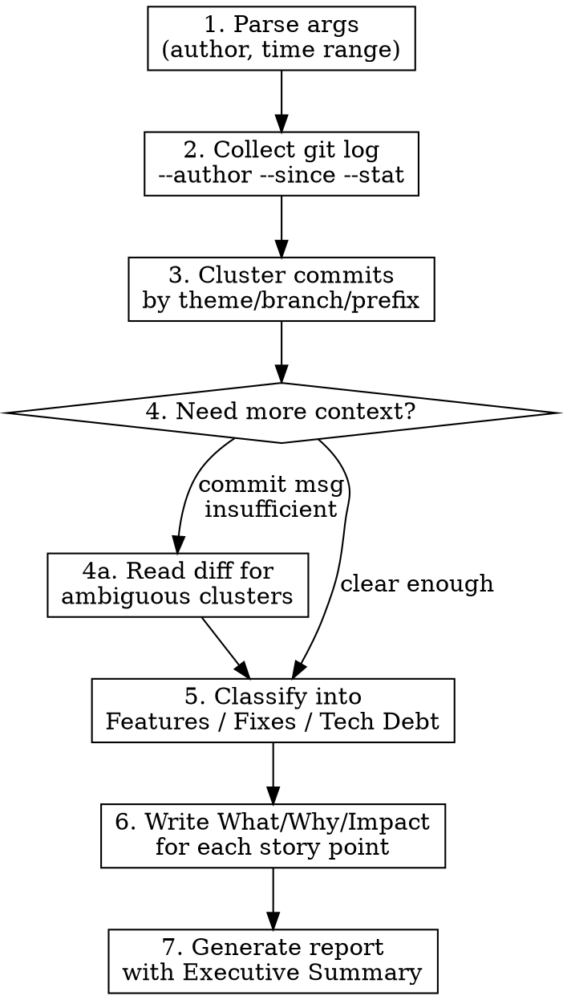

# Developer Review

Generate an impact-driven narrative report from git history. Each item answers: **What happened -> Why this decision -> Before vs After impact**.

## Usage

```
/dev-review                     # Self-review, past 7 days
/dev-review 2w                  # Self-review, past 2 weeks
/dev-review --author="Name"     # Review specific developer
/dev-review 1m --author="Name"  # Specific developer, past month
```

## Process



### Step 1: Parse Arguments

| Arg | Default | Examples |
|-----|---------|---------|
| author | `git config user.name` | `--author="Steven Wu"` |
| period | `1w` (7 days) | `2w`, `1m`, `3m` |

### Step 2: Collect Git Log

```bash
# Get commits with stats
git log --author="<name>" --since="<date>" --format="%H|%h|%s|%ad|%an" --date=short --stat

# Get commit count and summary
git shortlog --author="<name>" --since="<date>" -s -n
```

### Step 3: Cluster Commits by Theme

Group commits into **story points** (not 1:1 with commits). Clustering signals:

| Signal | Example |
|--------|---------|
| Same conventional commit scope | `feat(chat):` series |
| Same files touched repeatedly | 5 commits all in `chat/` |
| Same branch/PR | Commits on `feature/sse-migration` |
| Semantic relation in messages | All mention "SSE" or "migration" |

### Step 4: Selective Deep Dive

Read actual diffs ONLY when:
- Commit message is vague ("fix bug", "update", "wip")
- Cluster purpose is ambiguous
- Need to understand Before vs After impact

```bash
git diff <hash>^ <hash> --stat    # What files changed
git diff <hash>^ <hash>           # Full diff when needed
```

### Step 5: Classify Story Points

| Category | Criteria |
|----------|----------|
| Features Shipped | New user-facing capability or API |
| Bugs Fixed | Corrected wrong behavior |
| Tech Debt / Refactoring | Structural improvement, no behavior change |

If a story point spans categories, use the primary intent.

### Step 6: Write Narrative (What / Why / Impact)

For each story point, write exactly three lines:

- **What**: Factual description of the change (1 sentence)
- **Why**: The decision rationale - why this approach, why now (1-2 sentences)
- **Impact**: Concrete before vs after difference - metrics, LOC, behavior change (1 sentence)

Do NOT pad with filler. If Why or Impact is not inferable from commits/diffs, state what IS known rather than guessing.

### Step 7: Generate Report

## Report Template

```markdown
# Developer Review
> Author: {name} | Period: {start} ~ {end}

## Executive Summary

{2-3 sentences. Work themes + most significant outcome. Readable by non-engineers.}

## Summary Stats

| Metric | Value |
|--------|-------|
| Commits | {n} |
| Files changed | {n} |
| Insertions / Deletions | +{n} / -{n} |
| Top areas | {area1} ({pct}%), {area2} ({pct}%), ... |

## Features Shipped

### {Story Point Title}
- **What**: {description}
- **Why**: {decision rationale}
- **Impact**: {before -> after}
- {n} commits: {short_hashes} | areas: {dirs}

## Bugs Fixed

### {Story Point Title}
- **What**: {description}
- **Why**: {decision rationale}
- **Impact**: {before -> after}
- {n} commits: {short_hashes} | areas: {dirs}

## Tech Debt / Refactoring

### {Story Point Title}
- **What**: {description}
- **Why**: {decision rationale}
- **Impact**: {before -> after}
- {n} commits: {short_hashes} | areas: {dirs}
```

## Output

Save report to: `docs/reports/dev-review-{author}-{end_date}.md`

## Common Mistakes

| Mistake | Fix |
|---------|-----|
| Listing every commit as separate item | Cluster by theme first |
| Vague Impact ("improved code quality") | Quantify: LOC, latency, test count |
| Guessing Why when not inferable | State what's known, skip speculation |
| Reading all diffs upfront | Only deep-dive when commit messages are insufficient |
| Missing Executive Summary context | Write for someone who won't read the details |
